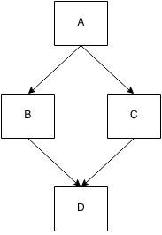

# You Don't Know JS: *this* & Object Prototypes
# Chapter 4: Mixing (Up) "Class" Objects

Following our exploration of objects from the previous chapter, it's natural that we now turn our attention to "object oriented (OO) programming", with "classes". We'll first look at "class orientation" as a design pattern, before examining the mechanics of "classes": "instantiation", "inheritance" and "(relative) polymorphism".

We'll see that these concepts don't really map very naturally to the object mechanism in JS, and the lengths (mixins, etc.) many JavaScript developers go to overcome such challenges.

**Note:** This chapter spends quite a bit of time (the first half!) on heavy "objected oriented programming" theory. We eventually relate these ideas to real concrete JavaScript code in the second half, when we talk about "Mixins". But there's a lot of concept and pseudo-code to wade through first, so don't get lost -- just stick with it!

## Class Theory

"Lớp/Thừa kế" mô tả một hình thức tổ chức và kiến trúc code nhất định - một cách mô hình hóa các vấn đề trong thế giới thực thành phần mềm của chúng ta.

Lập trình hướng đối tượng (OOP) nhấn mạnh rằng dữ liệu vốn có hành vi liên quan (tất nhiên, khác nhau tùy theo loại và bản chất của dữ liệu!) hoạt động trên nó, vì vậy thiết kế phù hợp là đóng gói (hay bao đóng) dữ liệu và hành vi lại với nhau. Điều này đôi khi được gọi là "cấu trúc dữ liệu" trong khoa học máy tính chính thức.

Ví dụ, một chuỗi ký tự đại diện cho một từ hoặc cụm từ thường được gọi là "chuỗi". Các ký tự là dữ liệu. Nhưng bạn hầu như không bao giờ chỉ quan tâm đến dữ liệu, bạn thường muốn *thực hiện các thao tác* với dữ liệu, vì vậy các hành vi có thể áp dụng *cho* dữ liệu đó (tính toán độ dài, thêm dữ liệu, tìm kiếm, v.v.) đều được thiết kế như các phương thức của lớp `String`.

Bất kỳ chuỗi nào được cho cũng chỉ là một thể hiện của lớp này, có nghĩa là nó là một gói được thu thập gọn gàng bao gồm cả dữ liệu ký tự và chức năng chúng ta có thể thực hiện trên nó.

Lớp cũng ngụ ý một cách để *phân loại* một cấu trúc dữ liệu nhất định. Cách chúng ta làm điều này là suy nghĩ về bất kỳ cấu trúc nào được cho là một biến thể cụ thể của một định nghĩa cơ bản chung hơn.

Hãy cùng khám phá quá trình phân loại này bằng cách xem xét một ví dụ được trích dẫn phổ biến. Một *xe hơi* có thể được mô tả như một triển khai cụ thể của một "lớp" tổng quát hơn, được gọi là *phương tiện*.

Chúng ta mô hình hóa mối quan hệ này trong phần mềm với các lớp bằng cách định nghĩa lớp `Vehicle` và lớp `Car`.

Định nghĩa của `Vehicle` có thể bao gồm những thứ như hệ thống đẩy (động cơ, v.v.), khả năng chở người, v.v., tất cả đều là các hành vi. Những gì chúng ta định nghĩa trong `Vehicle` là tất cả những thứ chung cho tất cả (hoặc hầu hết) các loại phương tiện khác nhau ("máy bay, tàu hỏa và ô tô").

Có thể không hợp lý trong phần mềm của chúng ta khi định nghĩa lại bản chất cơ bản của "khả năng chở người" nhiều lần cho từng loại phương tiện khác nhau. Thay vào đó, chúng ta định nghĩa khả năng đó một lần trong `Vehicle`, và sau đó khi định nghĩa `Car`, chúng ta chỉ đơn giản cho biết nó "thừa kế" (hoặc "mở rộng") định nghĩa cơ bản từ `Vehicle`. Định nghĩa của `Car` được cho là chuyên môn hóa định nghĩa chung của `Vehicle`.

Trong khi `Vehicle` và `Car` cùng nhau xác định hành vi thông qua các phương thức, thì dữ liệu trong một thể hiện sẽ là những thứ như mã VIN duy nhất của một chiếc xe cụ thể, v.v.

**Và do đó, các lớp, thừa kế và khởi tạo xuất hiện.**

Một khái niệm quan trọng khác với các lớp là "đa hình", mô tả ý tưởng rằng một hành vi chung từ lớp cha có thể được ghi đè trong lớp con để cung cấp cho nó nhiều chi tiết cụ thể hơn. Trên thực tế, đa hình tương đối cho phép chúng ta tham chiếu đến hành vi cơ bản từ hành vi đã được ghi đè.

Lý thuyết về lớp cho rằng một lớp cha và lớp con chia sẻ cùng một tên phương thức cho một hành vi nhất định, do đó lớp con ghi đè lớp cha (khác biệt). Như chúng ta sẽ thấy sau, việc thực hiện điều này trong code JavaScript của bạn sẽ dẫn đến sự thất vọng và code dễ gãy.

### "Class" Design Pattern

Bạn có thể chưa bao giờ nghĩ về các lớp như một "mô hình thiết kế", vì thông thường chúng ta thường thấy thảo luận về các "Mô hình thiết kế OO" phổ biến, như "Iterator", "Observer", "Factory", "Singleton", v.v. Theo cách trình bày này, gần như là một giả định rằng các lớp OO là cơ chế cấp thấp hơn mà chúng ta sử dụng để triển khai tất cả các mô hình thiết kế (cấp cao hơn), như thể OO là nền tảng nhất định cho *tất cả* code (tốt).

Tùy thuộc vào trình độ giáo dục chính thức của bạn về lập trình, bạn có thể đã nghe về "lập trình thủ tục" như một cách mô tả code chỉ bao gồm các thủ tục (hay hàm) gọi các hàm khác, mà không có bất kỳ sự trừu tượng hóa cao hơn nào. Bạn có thể đã được dạy rằng các lớp là cách *thích hợp* để biến code theo kiểu thủ tục thành code được tổ chức tốt và có dạng tốt.

Tất nhiên, nếu bạn có kinh nghiệm với "lập trình hàm" (Monads, v.v.), bạn biết rất rõ rằng các lớp chỉ là một trong số nhiều mô hình thiết kế phổ biến. Nhưng đối với những người khác, đây có thể là lần đầu tiên bạn tự hỏi liệu các lớp thực sự là nền tảng cơ bản cho code hay là một sự trừu tượng tùy chọn trên code.

Một số ngôn ngữ (như Java) không cho bạn lựa chọn, vì vậy nó không hề *tùy chọn* - mọi thứ đều là một lớp. Các ngôn ngữ khác như C/C++ hoặc PHP cung cấp cho bạn cả cú pháp thủ tục và hướng đối tượng, và việc lựa chọn phong cách hoặc sự kết hợp các phong cách nào là phù hợp phụ thuộc nhiều hơn vào lựa chọn của người phát triển.

### JavaScript "Classes"

Vậy JavaScript nằm ở đâu trong vấn đề này? JS đã có *một số* yếu tố cú pháp giống lớp (như `new` và `instanceof`) trong một thời gian khá dài, và gần đây hơn trong ES6, một số bổ sung như từ khóa `class` (xem Phụ lục A).

Nhưng điều đó có nghĩa là JavaScript thực sự *có* các lớp không? Nói một cách đơn giản: **Không.**

Vì các lớp là một mô hình thiết kế, bạn *có thể*, với khá nhiều nỗ lực (như chúng ta sẽ thấy trong suốt phần còn lại của chương này), thực hiện các xấp xỉ cho phần lớn chức năng của lớp cổ điển. JS cố gắng đáp ứng *mong muốn* cực kỳ phổ biến để thiết kế với các lớp bằng cách cung cấp cú pháp có vẻ giống lớp.

Mặc dù chúng ta có thể có cú pháp trông giống như lớp, nhưng cơ chế của JavaScript dường như đang chống lại bạn khi sử dụng *mô hình thiết kế lớp*, bởi vì đằng sau bức màn, các cơ chế mà bạn xây dựng trên đó hoạt động hoàn toàn khác. Cú pháp "syntactic sugar" và các thư viện "Class" của JS được sử dụng rộng rãi che giấu sự thật này khỏi bạn, nhưng sớm hay muộn bạn sẽ phải đối mặt với thực tế rằng các *lớp* bạn có trong các ngôn ngữ khác không giống như các "lớp" bạn đang giả mạo trong JS.

Điều này có nghĩa là các lớp là một mô hình tùy chọn trong thiết kế phần mềm, và bạn có thể chọn sử dụng chúng trong JavaScript hay không. Vì nhiều nhà phát triển có sở thích mạnh mẽ với thiết kế phần mềm hướng đối tượng, nên phần còn lại của chương này sẽ khám phá những gì cần thiết để duy trì ảo tưởng về các lớp với những gì JS cung cấp, và những điểm khó khăn chúng ta gặp phải.

## Class Mechanics

Trong nhiều ngôn ngữ hướng đối tượng, "thư viện chuẩn" cung cấp một cấu trúc dữ liệu "stack" (push, pop, v.v.) dưới dạng lớp `Stack`. Lớp này sẽ có một tập hợp biến nội bộ để lưu trữ dữ liệu và một tập hợp các hành vi ("phương thức") có thể truy cập công khai do lớp cung cấp, cho phép code của bạn tương tác với dữ liệu (ẩn) (thêm & xóa dữ liệu, v.v.).

Nhưng trong các ngôn ngữ như vậy, bạn không thực sự thao tác trực tiếp trên `Stack` (trừ khi tham chiếu thành viên tĩnh của lớp, điều này nằm ngoài phạm vi thảo luận của chúng ta). Lớp `Stack` chỉ là một giải thích trừu tượng về những gì *bất kỳ* "stack" nào nên làm, nhưng nó本身 không phải là một "stack". Bạn phải **khởi tạo** lớp `Stack` trước khi có một cấu trúc dữ liệu cụ thể để thao tác.

### Building

Cách suy nghĩ về "lớp" và "thể hiện" dựa trên một phép ẩn dụ trong xây dựng.

Kiến trúc sư sẽ phác thảo tất cả các đặc điểm của một tòa nhà: rộng bao nhiêu, cao bao nhiêu, bao nhiêu cửa sổ và vị trí đặt chúng, thậm chí cả loại vật liệu sử dụng cho tường và mái nhà. Tại thời điểm này, bà ấy không nhất thiết quan tâm đến *nơi nào* tòa nhà sẽ được xây dựng, cũng không quan tâm đến *bao nhiêu* bản sao của tòa nhà đó sẽ được xây dựng.

Bà ấy cũng không quan tâm nhiều đến nội thất của tòa nhà - đồ đạc, giấy dán tường, quạt trần, v.v. - mà chỉ quan tâm đến loại cấu trúc sẽ chứa chúng.

Bản vẽ kiến trúc mà bà ấy tạo ra chỉ là *kế hoạch* cho một tòa nhà. Chúng không thực sự tạo thành một tòa nhà mà chúng ta có thể bước vào và ngồi xuống. Chúng ta cần một người thợ xây cho nhiệm vụ đó. Người thợ xây sẽ lấy những bản kế hoạch đó và làm theo chúng một cách chính xác, khi anh ấy *xây dựng* tòa nhà. Theo một nghĩa rất thực tế, anh ấy đang *sao chép* các đặc điểm mong muốn từ bản vẽ sang tòa nhà vật lý.

Khi hoàn thành, tòa nhà là một hiện thân vật lý của bản vẽ, hy vọng là một *bản sao* hoàn hảo về cơ bản. Và sau đó, người thợ xây có thể chuyển đến lô đất trống bên cạnh và làm lại tất cả, tạo ra thêm một *bản sao* khác.

Mối quan hệ giữa tòa nhà và bản vẽ là gián tiếp. Bạn có thể xem xét bản vẽ để hiểu cấu trúc của tòa nhà, đối với bất kỳ phần nào mà việc kiểm tra trực tiếp tòa nhà là không đủ. Nhưng nếu bạn muốn mở cửa, bạn phải đến chính tòa nhà - bản vẽ chỉ có các đường kẻ trên trang *đại diện* cho vị trí của cửa.

Lớp là một bản vẽ. Để thực sự *có được* một đối tượng mà chúng ta có thể tương tác, chúng ta phải xây dựng (hay "khởi tạo") một thứ gì đó từ lớp. Kết quả cuối cùng của việc "xây dựng" như vậy là một đối tượng, thường được gọi là "thể hiện", mà chúng ta có thể trực tiếp gọi các phương thức và truy cập vào bất kỳ thuộc tính dữ liệu công khai nào, nếu cần thiết.

**Đối tượng này là một *bản sao*** của tất cả các đặc điểm được mô tả bởi lớp.

Bạn có thể sẽ không mong đợi bước vào một tòa nhà và tìm thấy, được đóng khung và treo trên tường, một bản sao của bản vẽ được sử dụng để xây dựng tòa nhà, mặc dù các bản vẽ đó có thể được lưu trong văn phòng hồ sơ công khai. Tương tự, bạn thường không sử dụng thể hiện đối tượng để trực tiếp truy cập và thao tác với lớp của nó, nhưng ít nhất bạn có thể xác định *lớp nào* mà thể hiện đối tượng đó xuất phát từ.

Việc xem xét mối quan hệ trực tiếp giữa lớp với thể hiện đối tượng, thay vì bất kỳ mối quan hệ gián tiếp nào giữa thể hiện đối tượng và lớp mà nó xuất phát, sẽ hữu ích hơn. **Một lớp được khởi tạo thành dạng đối tượng thông qua một hoạt động sao chép.**


As you can see, the arrows move from left to right, and from top to bottom, which indicates the copy operations that occur, both conceptually and physically.

### Constructor

Các thể hiện của lớp được xây dựng bởi một phương thức đặc biệt của lớp, thường có cùng tên với lớp, được gọi là *constructor*. Công việc rõ ràng của phương thức này là khởi tạo bất kỳ thông tin (trạng thái) nào mà thể hiện cần.

Ví dụ, hãy xem xét đoạn mã giả đơn giản này (cú pháp giả tạo) cho các lớp:

```js
class CoolGuy {
  specialTrick = nothing

  CoolGuy( trick ) {
    specialTrick = trick
  }

  showOff() {
    output( "Here's my trick: ", specialTrick )
  }
}
```

Để *tạo* một thể hiện `CoolGuy`, chúng ta sẽ gọi constructor của lớp:

```js
Joe = new CoolGuy( "jumping rope" )

Joe.showOff() // Here's my trick: jumping rope
```

Lưu ý rằng lớp `CoolGuy` có một constructor `CoolGuy()`, thực tế là thứ chúng ta gọi khi nói `new CoolGuy(..)`. Chúng ta nhận được một đối tượng (thể hiện của lớp) từ constructor, và chúng ta có thể gọi phương thức `showOff()`, nó sẽ in ra tuyệt chiêu đặc biệt của `CoolGuy` đó.

*Rõ ràng, nhảy dây khiến Joe trở thành một người khá thú vị.*

Constructor của một lớp *thuộc về* lớp đó, hầu như luôn có cùng tên với lớp. Ngoài ra, constructor thường gần như luôn cần được gọi với `new` để thông báo cho engine ngôn ngữ biết bạn muốn xây dựng một *thể hiện lớp mới*.

## Class Inheritance

Trong các ngôn ngữ hướng đối tượng, bạn không chỉ có thể định nghĩa một lớp có khả năng tự tạo thể hiện, mà còn có thể định nghĩa một lớp khác **thừa hưởng** từ lớp đầu tiên.

Lớp thứ hai thường được gọi là "lớp con" trong khi lớp đầu tiên là "lớp cha". Thuật ngữ này rõ ràng bắt nguồn từ phép ẩn dụ về cha mẹ và con cái, mặc dù những phép ẩn dụ ở đây có phần cường điệu, như bạn sẽ thấy ngay sau.

Khi cha mẹ có con đẻ, đặc điểm di truyền của cha mẹ sẽ được sao chép vào con. Tất nhiên, trong hầu hết các hệ thống sinh sản sinh học, có hai người cùng đóng góp gen đồng đều. Nhưng vì mục đích của phép ẩn dụ này, chúng ta sẽ chỉ giả định có một người cha mẹ.

Một khi đứa trẻ tồn tại, nó sẽ tách biệt khỏi cha mẹ. Đứa trẻ chịu ảnh hưởng nặng nề từ sự thừa hưởng của cha mẹ, nhưng nó vẫn là một cá thể riêng biệt và độc đáo. Nếu một đứa trẻ có mái tóc đỏ, điều đó không có nghĩa là tóc của cha mẹ *trước đây* hoặc tự động *trở thành* màu đỏ.

Tương tự như vậy, một khi lớp con được định nghĩa, nó sẽ tách biệt và khác biệt với lớp cha. Lớp con chứa một bản sao ban đầu về hành vi của lớp cha, nhưng sau đó có thể ghi đè lên bất kỳ hành vi thừa hưởng nào và thậm chí định nghĩa hành vi mới.

Điều quan trọng cần nhớ là chúng ta đang nói về lớp cha và lớp con, vốn không phải là những thứ vật lý. Đây là nơi mà phép ẩn dụ về cha mẹ và con cái trở nên hơi khó hiểu, bởi vì trên thực tế, chúng ta nên nói rằng lớp cha giống như DNA của cha mẹ và lớp con giống như DNA của con cái. Chúng ta phải tạo ra (hay "khởi tạo") một người từ mỗi bộ DNA để thực sự có một người thật để trò chuyện.

Hãy gác lại cha mẹ và con cái sinh học sang một bên, và nhìn vào sự thừa hưởng qua một lăng kính hơi khác: các loại phương tiện khác nhau. Đó là một trong những phép ẩn dụ phổ biến nhất (và thường gây nhàm chán) để hiểu về sự thừa hưởng.

Hãy xem lại cuộc thảo luận về `Vehicle` và `Car` từ trước đó trong chương này. Xem xét đoạn mã giả đơn giản này (cú pháp giả tạo) cho các lớp thừa hưởng:

```js
class Vehicle {
	engines = 1

	ignition() {
		output( "Turning on my engine." )
	}

	drive() {
		ignition()
		output( "Steering and moving forward!" )
	}
}

class Car inherits Vehicle {
	wheels = 4

	drive() {
		inherited:drive()
		output( "Rolling on all ", wheels, " wheels!" )
	}
}

class SpeedBoat inherits Vehicle {
	engines = 2

	ignition() {
		output( "Turning on my ", engines, " engines." )
	}

	pilot() {
		inherited:drive()
		output( "Speeding through the water with ease!" )
	}
}
```

**Lưu ý:** Để rõ ràng và ngắn gọn, các constructor cho các lớp này đã được lược bỏ.

Chúng ta định nghĩa lớp `Vehicle` để giả định có một động cơ, một cách để bật đánh lửa và một cách để lái xe xung quanh. Nhưng bạn sẽ không bao giờ sản xuất một "phương tiện" chung chung, vì vậy thực ra nó chỉ là một khái niệm trừu tượng ở thời điểm này.

Vì vậy, chúng ta định nghĩa hai loại phương tiện cụ thể: `Car` và `SpeedBoat`. Mỗi loại này đều thừa hưởng các đặc điểm chung của `Vehicle`, nhưng sau đó chúng chuyên môn hóa các đặc điểm phù hợp cho từng loại. Xe cần 4 bánh, còn tàu cao tốc cần 2 động cơ, điều đó có nghĩa là cần chú ý thêm để bật đánh lửa cho cả hai động cơ.

### Polymorphism

`Car` định nghĩa phương thức `drive()` riêng của nó, ghi đè lên phương thức cùng tên mà nó thừa hưởng từ `Vehicle`. Nhưng sau đó, phương thức `drive()` của `Car` lại gọi `inherited:drive()`, cho biết `Car` có thể tham chiếu đến phương thức `drive()` gốc đã được thừa hưởng trước đó. Phương thức `pilot()` của `SpeedBoat` cũng tham chiếu đến bản sao thừa hưởng của `drive()`.

Kỹ thuật này được gọi là "đa hình" (polymorphism) hoặc "đa hình ảo". Cụ thể hơn trong trường hợp này, chúng ta sẽ gọi nó là "đa hình tương đối".

Đa hình là một chủ đề rộng hơn nhiều so với những gì chúng ta sẽ thảo luận ở đây, nhưng ngữ nghĩa "tương đối" hiện tại của chúng ta đề cập đến một khía cạnh cụ thể: ý tưởng rằng bất kỳ phương thức nào cũng có thể tham chiếu đến một phương thức khác (cùng tên hoặc khác tên) ở cấp cao hơn trong hệ thống phân cấp thừa hưởng. Chúng ta nói "tương đối" vì chúng ta không xác định tuyệt đối cấp độ thừa hưởng (hay lớp) nào mà chúng ta muốn truy cập, mà thay vào đó tham chiếu tương đối bằng cách nói "xem lên một cấp".

Trong nhiều ngôn ngữ, từ khóa `super` được sử dụng thay cho `inherited:` trong ví dụ này, dựa trên ý tưởng rằng "lớp siêu" là lớp cha/tổ tiên của lớp hiện tại.

Một khía cạnh khác của đa hình là một tên phương thức có thể có nhiều định nghĩa ở các cấp độ khác nhau của chuỗi thừa hưởng, và các định nghĩa này sẽ tự động được chọn phù hợp khi xác định phương thức nào đang được gọi.

Chúng ta thấy hai trường hợp xảy ra như vậy trong ví dụ trên: `drive()` được định nghĩa trong cả `Vehicle` và `Car`, và `ignition()` được định nghĩa trong cả `Vehicle` và `SpeedBoat`.

**Lưu ý:** Một điều khác mà các ngôn ngữ hướng đối tượng truyền thống cung cấp cho bạn thông qua `super` là một cách trực tiếp để constructor của lớp con tham chiếu đến constructor của lớp cha. Điều này phần lớn là đúng vì với các lớp thực, constructor thuộc về lớp. Tuy nhiên, trong JS, điều ngược lại - thực ra nên coi "lớp" thuộc về constructor (tham chiếu kiểu `Foo.prototype...`). Vì trong JS, mối quan hệ giữa con và cha chỉ tồn tại giữa hai đối tượng `.prototype` tương ứng của các constructor, nên bản thân các constructor không liên quan trực tiếp với nhau, do đó không có cách đơn giản để tham chiếu tương đối từ constructor này sang constructor khác (xem Phụ lục A cho lớp ES6 "giải quyết" vấn đề này với `super`).

Một hàm ý thú vị của đa hình có thể được nhìn thấy cụ thể với `ignition()`. Bên trong `pilot()`, một tham chiếu đa hình tương đối được thực hiện đến phiên bản `drive()` của `Vehicle` (được thừa hưởng). Nhưng `drive()` đó tham chiếu đến phương thức `ignition()` chỉ theo tên (không có tham chiếu tương đối).

Phiên bản `ignition()` nào mà engine ngôn ngữ sẽ sử dụng, phiên bản từ `Vehicle` hay phiên bản từ `SpeedBoat`? **Nó sử dụng phiên bản `ignition()` của `SpeedBoat`.** Nếu bạn *tạo thể hiện* chính lớp `Vehicle` và sau đó gọi `drive()` của nó, engine ngôn ngữ sẽ chỉ sử dụng định nghĩa phương thức `ignition()` của `Vehicle`.

Nói cách khác, định nghĩa cho phương thức `ignition()` *đa hình* (thay đổi) tùy thuộc vào lớp (cấp độ thừa hưởng) mà bạn đang tham chiếu đến thể hiện.

Điều này có vẻ như là chi tiết học thuật quá sâu. Nhưng việc hiểu những chi tiết này là cần thiết để phân biệt chính xác các hành vi tương tự (nhưng khác biệt) trong cơ chế `[[Prototype]]` của JavaScript.

Khi các lớp được thừa hưởng, có một cách **cho chính các lớp** (không phải các thể hiện đối tượng được tạo từ chúng!) để tham chiếu *tương đối* đến lớp được thừa hưởng từ, và tham chiếu tương đối này thường được gọi là `super`.

Remember this figure from earlier:


Lưu ý rằng đối với cả việc tạo thể hiện (`a1`, `a2`, `b1`, và `b2`) *và* thừa hưởng (`Bar`), các mũi tên đều cho thấy một hoạt động sao chép.

Theo quan niệm, một lớp con `Bar` có thể truy cập hành vi trong lớp cha `Foo` của nó bằng cách sử dụng tham chiếu đa hình tương đối (hay `super`). Tuy nhiên, trên thực tế, lớp con chỉ được cung cấp một bản sao của hành vi được thừa hưởng từ lớp cha. Nếu lớp con "ghi đè" một phương thức mà nó thừa hưởng, cả phiên bản gốc và phiên bản đã ghi đè của phương thức đó đều được duy trì, do đó chúng đều có thể truy cập được.

Đừng để đa hình khiến bạn nhầm tưởng rằng một lớp con được liên kết với lớp cha của nó. Thay vào đó, một lớp con nhận được một bản sao những gì nó cần từ lớp cha. **Thừa hưởng lớp ngầm định là sao chép.**

### Multiple Inheritance

Bạn có nhớ cuộc thảo luận trước đó của chúng ta về cha mẹ và con cái và DNA không? Chúng ta đã nói rằng phép ẩn dụ này hơi kỳ lạ vì về mặt sinh học, hầu hết con cái đều có hai cha mẹ. Nếu một lớp có thể thừa hưởng từ hai lớp khác, nó sẽ phù hợp hơn với phép ẩn dụ về cha mẹ/con cái.

Một số ngôn ngữ hướng đối tượng cho phép bạn chỉ định nhiều hơn một lớp "cha mẹ" để "thừa hưởng". Đa thừa hưởng có nghĩa là mỗi định nghĩa lớp cha được sao chép vào lớp con.

Trên bề mặt, điều này dường như là một bổ sung mạnh mẽ cho tính hướng đối tượng, cho phép chúng ta kết hợp nhiều chức năng hơn với nhau. Tuy nhiên, chắc chắn sẽ có một số câu hỏi phức tạp phát sinh. Nếu cả hai lớp cha đều cung cấp một phương thức gọi là `drive()`, thì tham chiếu `drive()` trong lớp con sẽ giải quyết thành phiên bản nào? Bạn có luôn phải chỉ định thủ công `drive()` của cha mẹ nào bạn muốn, do đó mất đi một phần sự duyên dáng của thừa hưởng đa hình?

Còn có một biến thể khác, cái gọi là "Vấn đề kim cương", đề cập đến trường hợp lớp con "D" thừa hưởng từ hai lớp cha ("B" và "C"), và mỗi lớp này lại thừa hưởng từ một lớp cha chung "A". Nếu "A" cung cấp phương thức `drive()`, và cả "B" và "C" đều ghi đè (đa hình) phương thức đó, khi `D` tham chiếu đến `drive()`, nó nên sử dụng phiên bản nào (`B:drive()` hay `C:drive()`)?



Những phức tạp này còn sâu sắc hơn nhiều so với cái nhìn thoáng qua này. Chúng tôi đề cập đến chúng ở đây chỉ để có thể so sánh với cách thức hoạt động của cơ chế JavaScript.

JavaScript đơn giản hơn: nó không cung cấp cơ chế gốc cho "đa thừa hưởng". Nhiều người cho rằng đây là một điều tốt, vì việc tiết kiệm độ phức tạp còn hơn nhiều so với chức năng "giảm bớt". Nhưng điều này không ngăn cản các nhà phát triển cố gắng "giả mạo" nó theo nhiều cách khác nhau, như chúng ta sẽ thấy tiếp theo.

## Mixins

"Cơ chế đối tượng của JavaScript không tự động thực hiện hành vi sao chép khi bạn 'thừa kế' hoặc 'khởi tạo'. Nói một cách đơn giản, không có 'lớp' nào trong JavaScript để khởi tạo, mà chỉ có các đối tượng. Và các đối tượng không được sao chép sang các đối tượng khác, chúng được liên kết với nhau (sẽ đề cập chi tiết hơn trong Chương 5).

Do hành vi lớp được quan sát trong các ngôn ngữ khác thường bao hàm hành vi sao chép, chúng ta hãy xem xét cách các nhà phát triển JS giả mạo hành vi sao chép thiếu của các lớp trong JavaScript: mixin. Chúng ta sẽ xem xét hai loại 'mixin': rõ ràng và ngầm định."

### Explicit Mixins

## Dịch sang tiếng Việt chuyên ngành công nghệ thông tin:

**Xem xét lại ví dụ `Vehicle` và `Car` trước đây.** Do JavaScript không tự động sao chép hành vi từ `Vehicle` sang `Car`, chúng ta có thể tạo một tiện ích để sao chép thủ công. Tiện ích này thường được gọi là `extend(..)` trong nhiều thư viện/khung, nhưng ở đây chúng ta sẽ gọi nó là `mixin(..)` cho mục đích minh họa.

```js
// vastly simplified `mixin(..)` example:
function mixin( sourceObj, targetObj ) {
	for (var key in sourceObj) {
		// only copy if not already present
		if (!(key in targetObj)) {
			targetObj[key] = sourceObj[key];
		}
	}

	return targetObj;
}

var Vehicle = {
	engines: 1,

	ignition: function() {
		console.log( "Turning on my engine." );
	},

	drive: function() {
		this.ignition();
		console.log( "Steering and moving forward!" );
	}
};

var Car = mixin( Vehicle, {
	wheels: 4,

	drive: function() {
		Vehicle.drive.call( this );
		console.log( "Rolling on all " + this.wheels + " wheels!" );
	}
} );
```

**Lưu ý:** Một điểm tinh tế nhưng quan trọng là chúng ta không còn thực sự làm việc với các lớp nữa, vì JavaScript không có lớp theo đúng nghĩa. `Vehicle` và `Car` chỉ đơn giản là các đối tượng mà chúng ta sao chép thuộc tính và phương thức từ đối tượng này sang đối tượng khác.

Bây giờ, `Car` có một bản sao của các thuộc tính và phương thức từ `Vehicle`. Về mặt kỹ thuật, các phương thức không thực sự được sao chép, mà chỉ sao chép *tham chiếu* đến các phương thức đó. Do đó, `Car` hiện có một thuộc tính gọi là `ignition`, là tham chiếu được sao chép của phương thức `ignition()`, cũng như một thuộc tính gọi là `engines` với giá trị `1` được sao chép từ `Vehicle`.

`Car` *đã* có một thuộc tính `drive` (phương thức), vì vậy tham chiếu thuộc tính đó không bị ghi đè (xem câu lệnh `if` trong `mixin(..)` ở trên).

#### "Polymorphism" Revisited

**Phân tích câu lệnh `Vehicle.drive.call( this )`:** Đây là thứ mà tôi gọi là "đa hình giả tường minh". Nhớ lại trong đoạn mã giả trước đó, dòng này là `inherited:drive()`, được gọi là "đa hình tương đối".

JavaScript không có (trước ES6; xem Phụ lục A) cơ chế cho đa hình tương đối. Do đó, **vì cả `Car` và `Vehicle` đều có một phương thức cùng tên: `drive()`**, để phân biệt giữa việc gọi phương thức của đối tượng này hay đối tượng kia, chúng ta phải sử dụng tham chiếu tuyệt đối (không tương đối). Chúng ta chỉ định rõ ràng đối tượng `Vehicle` theo tên và gọi phương thức `drive()` trên nó.

Tuy nhiên, nếu chúng ta nói `Vehicle.drive()`, ràng buộc `this` cho cuộc gọi hàm đó sẽ là đối tượng `Vehicle` thay vì đối tượng `Car` (xem Chương 2), điều này không phải là điều chúng ta mong muốn. Vì vậy, thay vào đó, chúng ta sử dụng `.call( this )` (Chương 2) để đảm bảo `drive()` được thực thi trong ngữ cảnh của đối tượng `Car`.

**Lưu ý:** Nếu tên định danh của phương thức `Car.drive()` không trùng lặp (hay còn gọi là "che khuất"; xem Chương 5) với `Vehicle.drive()`, chúng ta sẽ không cần sử dụng "đa hình phương thức". Do đó, tham chiếu đến `Vehicle.drive()` sẽ được sao chép qua cuộc gọi `mixin(..)` và chúng ta có thể truy cập trực tiếp bằng `this.drive()`. Việc trùng lặp tên định danh (che khuất) **là lý do** tại sao chúng ta phải sử dụng phương pháp "đa hình giả tường minh" phức tạp hơn.

Trong các ngôn ngữ hướng lớp, vốn có đa hình tương đối, liên kết giữa `Car` và `Vehicle` được thiết lập một lần, ở đầu định nghĩa lớp, chỉ cần duy trì mối quan hệ này ở một vị trí.

Nhưng do những đặc thù của JavaScript, đa hình giả tường minh (do che khuất!) tạo ra liên kết thủ công/tường minh dễ gãy trong **mỗi hàm đơn lẻ cần tham chiếu đa hình (giả) như vậy**. Điều này có thể làm tăng đáng kể chi phí bảo trì. Hơn nữa, trong khi đa hình giả tường minh có thể mô phỏng hành vi của "đa thừa kế", nó chỉ làm tăng thêm tính phức tạp và dễ gãy.

Kết quả của những cách tiếp cận như vậy thường là mã phức tạp hơn, khó đọc hơn *và* khó bảo trì hơn. **Nên tránh đa hình giả tường minh bất cứ khi nào có thể**, vì chi phí thường lớn hơn lợi ích trong hầu hết các trường hợp.

#### Mixing Copies

Recall the `mixin(..)` utility from above:

```js
// vastly simplified `mixin()` example:
function mixin( sourceObj, targetObj ) {
	for (var key in sourceObj) {
		// only copy if not already present
		if (!(key in targetObj)) {
			targetObj[key] = sourceObj[key];
		}
	}

	return targetObj;
}
```

Bây giờ, chúng ta hãy xem cách `mixin(..)` hoạt động. Nó lặp qua các thuộc tính của `sourceObj` (`Vehicle` trong ví dụ của chúng ta) và nếu không có thuộc tính trùng tên trong `targetObj` (`Car` trong ví dụ của chúng ta), nó sẽ tạo một bản sao. Do chúng ta tạo bản sao sau khi đối tượng ban đầu tồn tại, nên chúng ta cẩn thận không sao chép đè lên thuộc tính của đối tượng đích.

Nếu chúng ta tạo các bản sao trước tiên, trước khi chỉ định nội dung cụ thể của `Car`, chúng ta có thể bỏ qua kiểm tra này đối với `targetObj`, nhưng điều đó hơi cồng kềnh và kém hiệu quả hơn, vì vậy nói chung là ít được ưa chuộng hơn:

```js
// alternate mixin, less "safe" to overwrites
function mixin( sourceObj, targetObj ) {
	for (var key in sourceObj) {
		targetObj[key] = sourceObj[key];
	}

	return targetObj;
}

var Vehicle = {
	// ...
};

// first, create an empty object with
// Vehicle's stuff copied in
var Car = mixin( Vehicle, { } );

// now copy the intended contents into Car
mixin( {
	wheels: 4,

	drive: function() {
		// ...
	}
}, Car );
```

Bằng cả hai cách tiếp cận, chúng ta đã sao chép rõ ràng các nội dung không trùng lặp của `Vehicle` vào `Car`. Tên "mixin" xuất phát từ một cách giải thích nhiệm vụ khác: `Car` có các nội dung của `Vehicle` được "trộn lẫn", giống như bạn trộn sôcôla chip vào bột bánh quy yêu thích của mình.

Kết quả của thao tác sao chép, `Car` sẽ hoạt động phần nào tách biệt với `Vehicle`. Nếu bạn thêm một thuộc tính vào `Car`, nó sẽ không ảnh hưởng đến `Vehicle`, và ngược lại.

**Lưu ý:** Một vài chi tiết nhỏ đã bị bỏ qua ở đây. Vẫn có một số cách tinh tế mà hai đối tượng có thể "ảnh hưởng" lẫn nhau ngay cả sau khi sao chép, chẳng hạn như nếu cả hai đều chia sẻ tham chiếu đến một đối tượng chung (chẳng hạn như một mảng).

Vì hai đối tượng cũng chia sẻ tham chiếu đến các hàm chung của chúng, điều đó có nghĩa là **ngay cả việc sao chép thủ công các hàm (hay còn gọi là mixins) từ một đối tượng sang đối tượng khác cũng không *thực sự mô phỏng* sự trùng lặp thực sự từ lớp sang thể hiện xảy ra trong các ngôn ngữ hướng đối tượng**.

Các hàm JavaScript không thể thực sự được sao chép (theo cách tiêu chuẩn, đáng tin cậy), vì vậy thay vào đó, bạn sẽ có được một **tham chiếu trùng lặp** đến cùng một đối tượng hàm được chia sẻ (hàm là đối tượng; xem Chương 3). Nếu bạn sửa đổi một trong các **đối tượng hàm** được chia sẻ (như `ignition()`) bằng cách thêm các thuộc tính lên trên, thì cả `Vehicle` và `Car` đều sẽ bị "ảnh hưởng" thông qua tham chiếu được chia sẻ.

Mixin rõ ràng là một cơ chế tốt trong JavaScript. Nhưng chúng có vẻ mạnh mẽ hơn thực tế. **Thực sự không có nhiều lợi ích* được rút ra từ việc sao chép một thuộc tính từ đối tượng này sang đối tượng khác, **so với việc chỉ cần định nghĩa các thuộc tính hai lần**, mỗi đối tượng một lần. Và điều đó đặc biệt đúng khi xem xét đến sự tinh tế về tham chiếu đối tượng hàm mà chúng ta vừa đề cập.

Nếu bạn trộn lẫn rõ ràng hai hoặc nhiều đối tượng vào đối tượng mục tiêu của mình, bạn có thể **части nào mô phỏng** hành vi của "đa thừa kế", nhưng không có cách trực tiếp nào để xử lý va chạm nếu cùng một phương thức hoặc thuộc tính đang được sao chép từ nhiều nguồn. Một số nhà phát triển / thư viện đã đưa ra các kỹ thuật "liên kết trễ" và các giải pháp thay thế kỳ lạ khác, nhưng về cơ bản, những "mẹo" này **thường* đòi hỏi nhiều công sức hơn (và hiệu suất thấp hơn!) so với lợi ích thu được.

Chỉ sử dụng mixin rõ ràng khi nó thực sự giúp tạo ra mã dễ đọc hơn và tránh mô hình này nếu bạn thấy nó khiến mã khó theo dõi hơn hoặc nếu bạn thấy nó tạo ra các phụ thuộc không cần thiết hoặc khó xử lý giữa các đối tượng.

**Nếu việc sử dụng mixin bắt đầu trở nên *khó khăn hơn* so với trước khi bạn sử dụng chúng**, có lẽ bạn nên ngừng sử dụng mixin. Trên thực tế, nếu bạn phải sử dụng một thư viện / tiện ích phức tạp để giải quyết tất cả các chi tiết này, thì đó có thể là dấu hiệu cho thấy bạn đang thực hiện theo cách khó hơn, có lẽ là không cần thiết. Trong Chương 6, chúng tôi sẽ cố gắng chắt lọc một cách đơn giản hơn để đạt được kết quả mong muốn mà không cần quá phức tạp.

#### Parasitic Inheritance

A variation on this explicit mixin pattern, which is both in some ways explicit and in other ways implicit, is called "parasitic inheritance", popularized mainly by Douglas Crockford.

Here's how it can work:

```js
// "Traditional JS Class" `Vehicle`
function Vehicle() {
	this.engines = 1;
}
Vehicle.prototype.ignition = function() {
	console.log( "Turning on my engine." );
};
Vehicle.prototype.drive = function() {
	this.ignition();
	console.log( "Steering and moving forward!" );
};

// "Parasitic Class" `Car`
function Car() {
	// first, `car` is a `Vehicle`
	var car = new Vehicle();

	// now, let's modify our `car` to specialize it
	car.wheels = 4;

	// save a privileged reference to `Vehicle::drive()`
	var vehDrive = car.drive;

	// override `Vehicle::drive()`
	car.drive = function() {
		vehDrive.call( this );
		console.log( "Rolling on all " + this.wheels + " wheels!" );
	};

	return car;
}

var myCar = new Car();

myCar.drive();
// Turning on my engine.
// Steering and moving forward!
// Rolling on all 4 wheels!
```

Như bạn có thể thấy, ban đầu chúng ta tạo một bản sao của định nghĩa từ "lớp cha" (`Vehicle`) (đối tượng), sau đó trộn lẫn định nghĩa của "lớp con" (đối tượng) (duy trì các tham chiếu đặc quyền của lớp cha khi cần), và truyền đối tượng `car` được tạo thành này làm thể hiện của lớp con.

**Lưu ý:** khi chúng ta gọi `new Car()`, một đối tượng mới được tạo và được tham chiếu bởi tham chiếu `this` của `Car` (xem Chương 2). Nhưng vì chúng ta không sử dụng đối tượng đó, mà thay vào đó trả về đối tượng `car` của riêng mình, nên đối tượng được tạo ban đầu sẽ bị loại bỏ. Vì vậy, `Car()` có thể được gọi mà không cần từ khóa `new`, và chức năng ở trên sẽ giống hệt nhau, nhưng không có việc tạo/thu gom rác đối tượng lãng phí.

### Implicit Mixins

Implicit mixins are closely related to *explicit pseudo-polymorphism* as explained previously. As such, they come with the same caveats and warnings.

Consider this code:

```js
var Something = {
	cool: function() {
		this.greeting = "Hello World";
		this.count = this.count ? this.count + 1 : 1;
	}
};

Something.cool();
Something.greeting; // "Hello World"
Something.count; // 1

var Another = {
	cool: function() {
		// implicit mixin of `Something` to `Another`
		Something.cool.call( this );
	}
};

Another.cool();
Another.greeting; // "Hello World"
Another.count; // 1 (not shared state with `Something`)
```

Với `Something.cool.call( this )`, có thể xảy ra trong cả cuộc gọi "constructor" (phổ biến nhất) hoặc trong cuộc gọi method (được hiển thị ở đây), về cơ bản chúng ta "mượn" hàm `Something.cool()` và gọi nó trong ngữ cảnh của `Another` (thông qua ràng buộc `this` của nó; xem Chương 2) thay vì `Something`. Kết quả cuối cùng là các phép gán mà `Something.cool()` thực hiện được áp dụng cho đối tượng `Another` thay vì đối tượng `Something`.

Vì vậy, người ta nói rằng chúng ta đã "trộn lẫn" hành vi của `Something` với (hoặc vào) `Another`.

Mặc dù kỹ thuật này dường như tận dụng lợi thế hữu ích của chức năng ràng buộc lại `this`, nhưng chính cuộc gọi `Something.cool.call( this )` giòn giòn, không thể được chuyển thành một tham chiếu tương đối (và do đó linh hoạt hơn) mà bạn nên **cẩn thận**. Nói chung, **nếu có thể, hãy tránh các cấu trúc như vậy** để giữ cho mã sạch hơn và dễ bảo trì hơn.

## Review (TL;DR)

**Lớp là một mô hình thiết kế.** Nhiều ngôn ngữ cung cấp cú pháp cho phép thiết kế phần mềm theo hướng đối tượng một cách tự nhiên. JavaScript cũng có cú pháp tương tự, nhưng nó hoạt động **rất khác** so với những gì bạn đã quen thuộc với các lớp trong các ngôn ngữ khác.

**Lớp có nghĩa là sao chép.**

Khi các lớp truyền thống được khởi tạo, hành vi từ lớp sang thể hiện sẽ được sao chép. Khi các lớp được kế thừa, hành vi từ lớp cha sang lớp con cũng được sao chép.

Đa hình (có các hàm khác nhau ở nhiều cấp độ của chuỗi thừa kế với cùng tên) có vẻ như ngụ ý một liên kết tương đối tham chiếu từ con trở lại cha, nhưng nó vẫn chỉ là kết quả của hành vi sao chép.

JavaScript **không tự động** tạo các bản sao (như các lớp ngụ ý) giữa các đối tượng.

Mô hình mixin (cả rõ ràng và ngầm) thường được sử dụng để *gần như* mô phỏng hành vi sao chép lớp, nhưng điều này thường dẫn đến cú pháp khó hiểu và dễ gãy như đa hình giả tường minh (`OtherObj.methodName.call(this, ...)`), thường dẫn đến mã khó hiểu và khó bảo trì hơn.

Mixin rõ ràng cũng không hoàn toàn giống với sao chép lớp, vì các đối tượng (và hàm!) chỉ có các tham chiếu được chia sẻ được trùng lặp, chứ không phải chính các đối tượng/hàm được trùng lặp. Không chú ý đến sự tinh tế như vậy là nguồn gốc của nhiều lỗi bất ngờ.

Nói chung, việc giả mạo các lớp trong JS thường đặt ra nhiều "bom mìn" cho việc lập trình trong tương lai hơn là giải quyết các vấn đề thực tế hiện tại.

